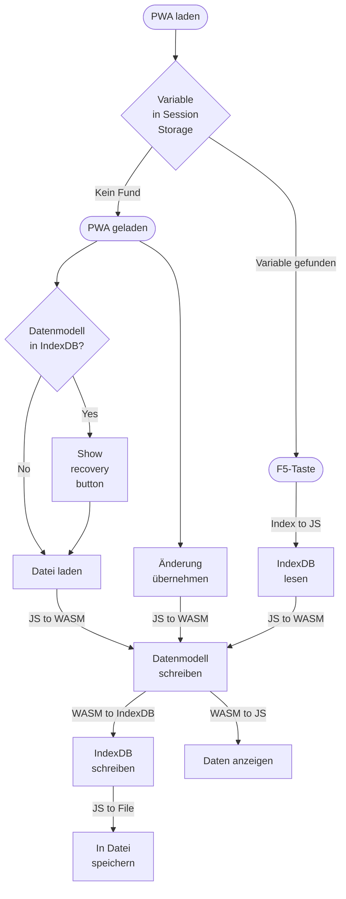

# Wiki CE-Declara

## MVVM-Pattern

The pattern consists of three parts.

### View

The View main part is the index html.
In there all other HTML views will be included.
Therfore js files are provided.

#### codebehind.js

This code handles all global events and is initializing the application.

#### ContentLoader.js

This code is initialized by codebehind.js.
It is responsible to load the correct html to the main conten.

## Prozess Laden und speichern

Beim Öffnen der PWA sind keine Daten im Arbeitsspeicher geladen.
Um die Daten zu strukturieren soll es im Reiter Datenquelle die Möglichkeit geben eine Datei zu laden, oder den Inhalt der IndexDB falls vorhanden zu laden.

Die Unterscheidung ob die Applikation gerade geöffnet oder jemand die F5-Taste gedrückt hat, kann wie folgt erfolgen.
Als erstes wird geprüft ob eine bestimmte Variable im Session-Speicher vorhanden ist.
Ist diese nicht vorhanden, dann muss es sich um das erstmalige Starten handeln.
Ist sie vorhanden, dann hat jemand wahrscheinlich die F5-Taste betätigt.

Die Übertragung zwischen JS und WASM soll immer über das Datenmodell an sich erfolgen.
Theoretisch müssten so nur Objekte serialisiert werden.
D.h. wir verwenden das JSON-Format für die Speicherung.
